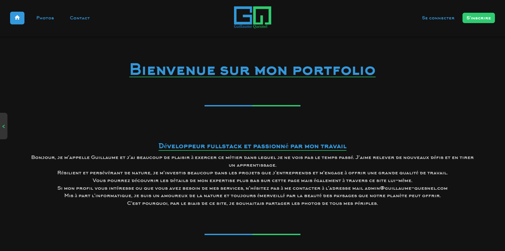

# Photo Album & Portfolio Platform

A full-stack web application combining a personal **portfolio** with a multi-user **photo album manager**: users register, create albums, upload photos, and interact through likes and comments, while administrators moderate content. Built with a **Symfony** backend and a **React + TypeScript** frontend, fully containerized with Docker and available in **4 languages** (English, French, German, Spanish).

🔗 **Live demo:** [guillaume-quesnel.com](https://guillaume-quesnel.com)




> _Add your screenshot at `docs/screenshot-home.png` (a capture of the home page or the album gallery works best). A short GIF of the gallery hover effect also works — name it `docs/demo.gif` and reference it here._

---

## ✨ Features

- **Portfolio** — home page, presentation, skills, timeline, project carousel and downloadable CV.
- **Authentication & roles** — registration, login with a home-made captcha, password reset by email, and a three-tier role system (`ROLE_USER`, `ROLE_ADMIN`, `ROLE_SUPER_ADMIN`).
- **Albums & photos** — users create albums and upload images (JPEG/PNG, validated by MIME type and size); per-album visibility and approval rules enforced by role.
- **Social features** — likes and comments on photos, with a moderation dashboard for admins.
- **Content management** — admin-only article editor (TinyMCE), user management and moderation from a paginated dashboard.
- **Internationalization** — full UI translated in EN / FR / DE / ES via Symfony Translation + `i18next`.
- **Legal & GDPR** — terms of use, legal notice, privacy & cookie policy, cookie consent banner.
- **Transactional email** — contact form and account emails (MailHog in development).

## 🛠️ Tech stack

| Layer        | Technologies |
|--------------|--------------|
| Backend      | PHP, Symfony 5.4 (LTS), Doctrine ORM, Twig |
| Frontend     | React 18, TypeScript, Webpack Encore, SCSS, Swiper, react-i18next |
| Database     | MySQL 8 |
| Infra / Dev  | Docker, Docker Compose, Nginx, MailHog |
| CI           | GitHub Actions |
| Tooling      | Composer, Yarn, PHPUnit, KnpPaginator |

## 🏗️ Architecture

```
album_photo_clean/
├── src/
│   ├── Controller/     # HTTP endpoints (portfolio, albums, photos, auth, admin…)
│   ├── Entity/         # Doctrine entities (User, Album, Photo, Comment, Like, Article, Theme)
│   ├── Repository/     # Custom queries
│   ├── Form/           # Symfony form types
│   ├── Security/       # Authenticator & user checker
│   ├── Service/        # Business logic (e.g. album visibility, captcha)
│   ├── EventListener/  # Locale, exception, user-ban handling
│   └── Validator/      # Custom constraints (captcha)
├── assets/             # React + TypeScript components, SCSS, i18n
├── templates/          # Twig views
├── translations/       # messages.{en,fr,de,es}.yaml
├── migrations/         # Doctrine migrations
├── tests/              # PHPUnit
└── docker-compose.yml
```

The frontend is compiled by Webpack Encore and mounted into Twig templates, so Symfony serves the pages while React handles the interactive components.

## 🚀 Getting started

### Prerequisites

- Docker & Docker Compose
- (For frontend builds) Node.js 18+ and Yarn

### 1. Clone and configure

```bash
git clone https://github.com/qguillaume/album_photo.git
cd album_photo

# Create your local environment file (never commit real secrets)
cp .env .env.local
# then edit .env.local: set APP_SECRET, DATABASE_URL, MAILER_DSN
```

### 2. Start the stack

```bash
docker compose up -d --build
```

This starts:

| Service  | URL / Port                | Description        |
|----------|---------------------------|--------------------|
| Nginx    | http://localhost:8000     | Application        |
| MySQL    | localhost:3306            | Database           |
| MailHog  | http://localhost:8025     | Caught emails (UI) |

### 3. Set up the database

```bash
docker compose exec php composer install
docker compose exec php php bin/console doctrine:migrations:migrate
```

### 4. Build the frontend

```bash
yarn install
yarn dev        # development build
# or
yarn watch      # rebuild on change
yarn build      # production build
```

The app is now available at **http://localhost:8000**.

## ✅ Tests

```bash
docker compose exec php php bin/phpunit
```

> ⚠️ The test suite is currently minimal and being expanded. Contributions to coverage are tracked as a priority.

## 🔐 Security notes

- Passwords are hashed with **bcrypt** (cost 12).
- Uploads are restricted to JPEG/PNG and size-limited.
- Secrets (`APP_SECRET`, database and mailer credentials) must live in `.env.local` / server environment variables and are **never committed**.

## 📄 License

Proprietary — all rights reserved. This repository is published for portfolio and demonstration purposes.

## 👤 Author

**Guillaume Quesnel** — [guillaume-quesnel.com](https://guillaume-quesnel.com)
